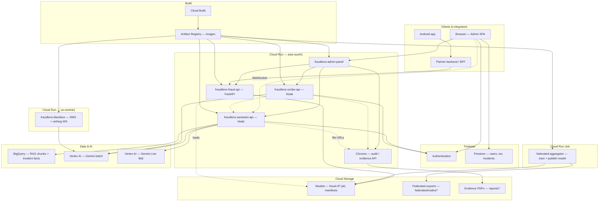

# FraudLens — Architecture (single diagram)

One consolidated Mermaid flowchart: clients, services, data, AI, and build. Paste into [mermaid.live](https://mermaid.live) or any Mermaid-capable Markdown viewer.

---

*Dashed lines: optional, WebSocket, or config-dependent paths.*
